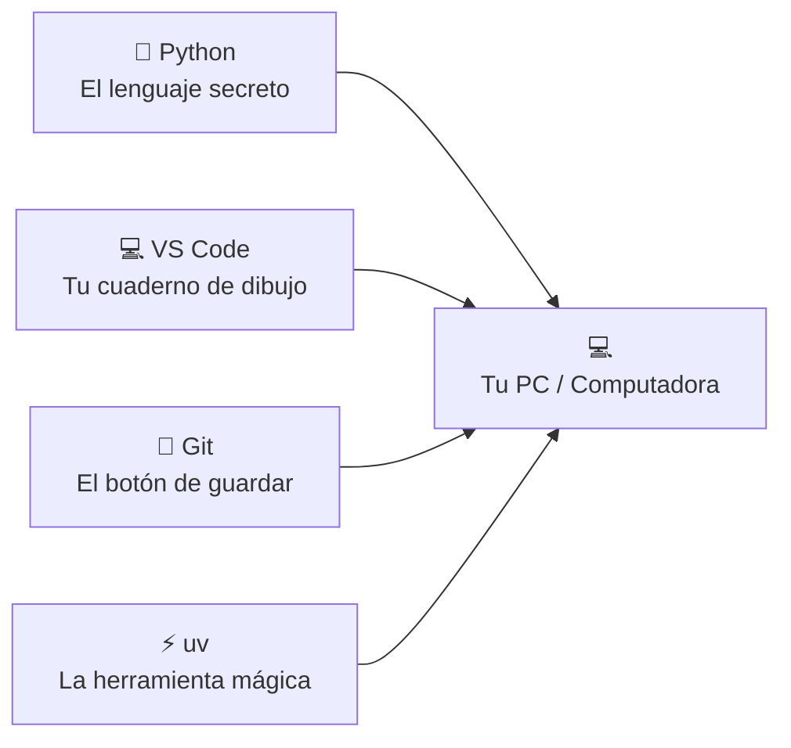

# Diagrama del Capítulo 1 — ¡Nuestras herramientas!

## Diagrama

## Explicación

Imagina que tu computadora es como una mesa de trabajo. Python, VS Code, Git y uv son **herramientas** que necesitas tener a mano. Cada herramienta se conecta a tu computadora para ayudarte a programar.

### Conexiones

| Flecha | Significado |
|--------|-------------|
| `Python --> 💻` | Python vive dentro de tu PC y le dice qué hacer |
| `VS Code --> 💻` | VS Code abre tu PC para que escribas código en él |
| `Git --> 💻` | Git guarda tus cambios dentro de tu PC |
| `uv --> 💻` | uv instala todo lo que necesitas dentro de tu PC |
