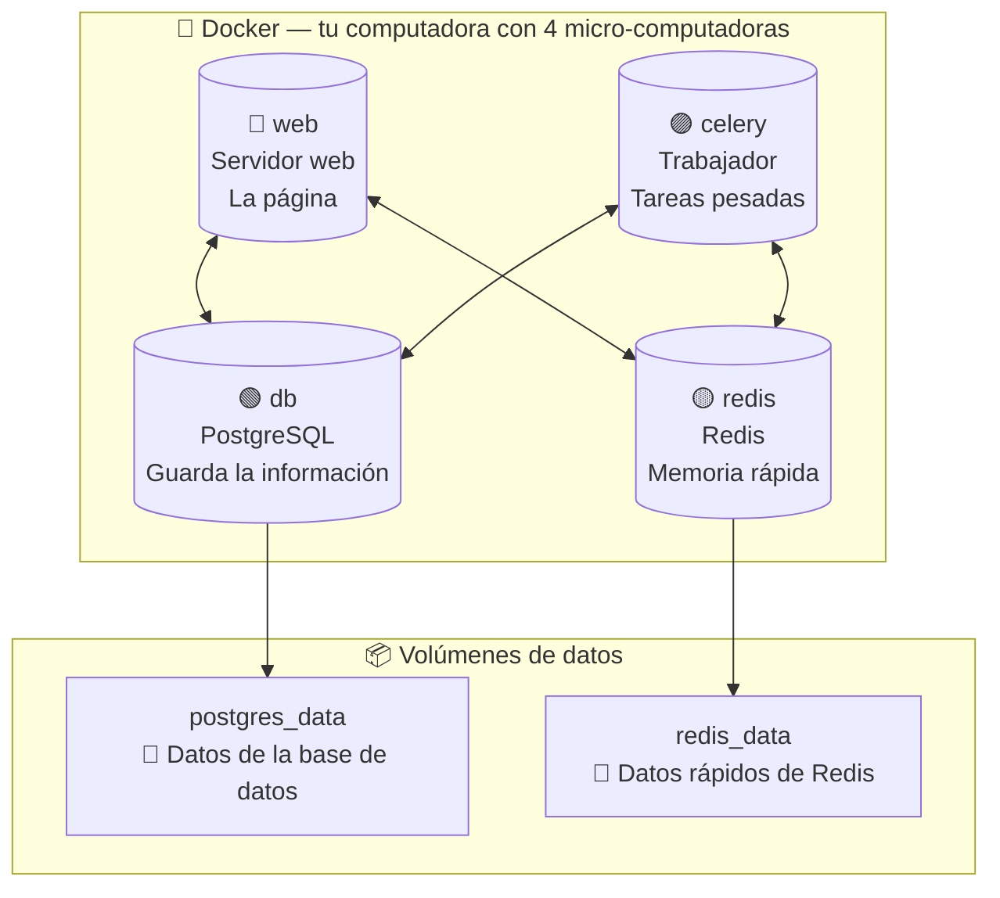

# Diagrama del Capítulo 2 — Las cajitas de Docker

## Diagrama

## Explicación

Docker crea **4 micro-computadoras** dentro de tu PC, como si tuvieras 4 amiguitos trabajando juntos. La base de datos (`db`) guarda los datos en un cajón (`postgres_data`), y Redis guarda datos rápidos en otro cajón (`redis_data`).

### Conexiones

| Flecha | Significado |
|--------|-------------|
| `db --> 💾` | La base de datos guarda sus datos en el cajón `postgres_data` |
| `redis --> 💾` | Redis guarda sus datos en el cajón `redis_data` |
| `web <--> db` | El servidor web **habla** con la base de datos para leer y escribir información |
| `web <--> redis` | El servidor web usa Redis para tareas rápidas |
| `celery <--> db` | El trabajador lee y escribe datos en la base de datos |
| `celery <--> redis` | El trabajador toma tareas de la memoria rápida de Redis |
