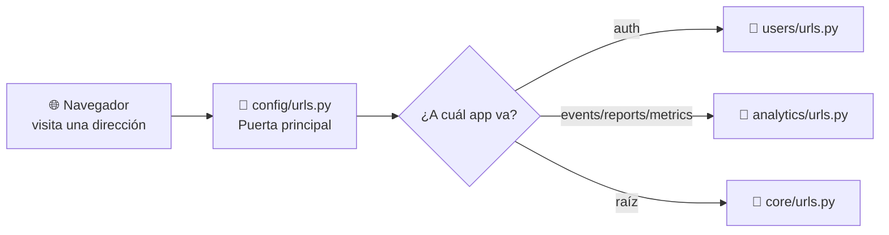

# Diagrama del Capítulo 3 — La estructura de carpetas

## Diagrama

```mermaid
graph TD
    ROOT[📁 InsightBoard<br/>La carpeta principal]

    CONFIG[📁 config/<br/>El "cerebro" del proyecto]
    SETTINGS[📁 settings/<br/>archivos: base.py, development.py]
    URLS[📄 urls.py<br/>La "puerta de entrada"]
    WSGI[📄 wsgi.py]
    ASGI[📄 asgi.py]
    MANAGE[📄 manage.py<br/>El "control remoto"]

    USERS[📁 apps/users/<br/>App de usuarios]
    ANALYTICS[📁 apps/analytics/<br/>App de análisis]
    CORE[📁 apps/core/<br/>App de utilidades]

    root_manage -.-> MANAGE
    ROOT --> CONFIG
    ROOT --> MANAGE
    ROOT --> USERS
    ROOT --> ANALYTICS
    ROOT --> CORE

    CONFIG --> SETTINGS
    CONFIG --> URLS
    CONFIG --> WSGI
    CONFIG --> ASGI

    USERS_URLS[📄 users/urls.py]
    ANALYTICS_URLS[📄 analytics/urls.py<br/>+ report_urls.py + metric_urls.py]
    CORE_URLS[📄 core/urls.py]

    USERS --> USERS_URLS
    ANALYTICS --> ANALYTICS_URLS
    CORE --> CORE_URLS

    URLS =--> USERS_URLS
    URLS =--> ANALYTICS_URLS
    URLS =--> CORE_URLS
```

## Explicación

Imagina tu proyecto como una casa con habitaciones. `manage.py` es el **control remoto** con el que le das órdenes a toda la casa. Dentro está `config/`, el cerebro que controla todo, y tres apps: `users` (personas), `analytics` (datos) y `core` (utilidades).

### Cómo fluyen las URLs (el pasaporte de cada petición)

1. 📄 `config/urls.py` es como la **puerta principal** de la casa.
2. Cuando alguien visita una dirección, `urls.py` mira la dirección y dice: **"¡Vete a la app que corresponde!"**
   - `/api/auth/` → 📄 `apps/users/urls.py`
   - `/api/events/` → 📄 `apps/analytics/urls.py`
   - `/api/reports/` → 📄 `apps/analytics/report_urls.py`
   - `/api/metrics/` → 📄 `apps/analytics/metric_urls.py`
   - `/` (raíz) → 📄 `apps/core/urls.py`

### Conexiones

| Flecha | Significado |
|--------|-------------|
| `ROOT --> config` | La carpeta principal contiene el cerebro del proyecto |
| `ROOT --> manage.py` | El control remoto está en la carpeta principal |
| `URLS =--> apps/*/urls.py` | El `urls.py` principal **envía** cada solicitud a la app correspondiente |
| `app --> app/urls.py` | Cada app tiene su propio archivo de rutas |


