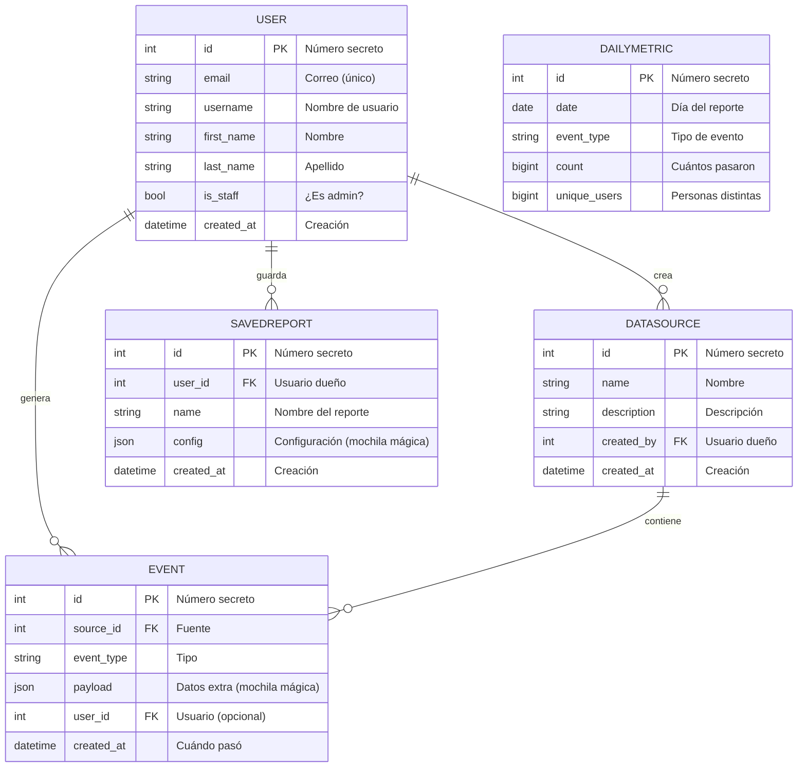

# Diagrama del Capítulo 4 — El diagrama de piezas (ER)

## Diagrama

## Explicación

Imagina que cada tabla es una **caja de LEGO**. Cada caja guarda información y las cajas se unen con **pegamento especial** llamado *llave foránea* (FK). Un `User` puede crear muchos `DataSource`, y cada `DataSource` puede tener muchos `Event`. Los corazones (`||--o{`) significan "uno a muchos".

- `payload` y `config` son como **mochilas mágicas** (`JSONField`) donde guardas cualquier cosa.
- `DailyMetric` no se conecta a otras cajas: es un reporte pre-armado que ya viene listito.

### Conexiones (relaciones)

| Flecha | Significado |
|--------|-------------|
| `User` ❤️ 1 → N ❤️ `DataSource` | Un usuario puede tener **muchas** fuentes de datos |
| `User` ❤️ 1 → N ❤️ `Event` | Un usuario puede generar **muchos** eventos (es opcional) |
| `User` ❤️ 1 → N ❤️ `SavedReport` | Un usuario puede guardar **muchos** reportes |
| `DataSource` ❤️ 1 → N ❤️ `Event` | Una fuente puede contener **muchos** eventos |

### Atributos principales

| Entidad | Atributos clave |
|---------|-----------------|
| **User** | email (único), username, first_name, last_name |
| **DataSource** | name, description, created_by (→ User), created_at |
| **Event** | event_type, payload (JSON) → source (→ DataSource) → user (→ User) |
| **SavedReport** | name, config (JSON) → user (→ User) |
| **DailyMetric** | date, event_type, count, unique_users |
